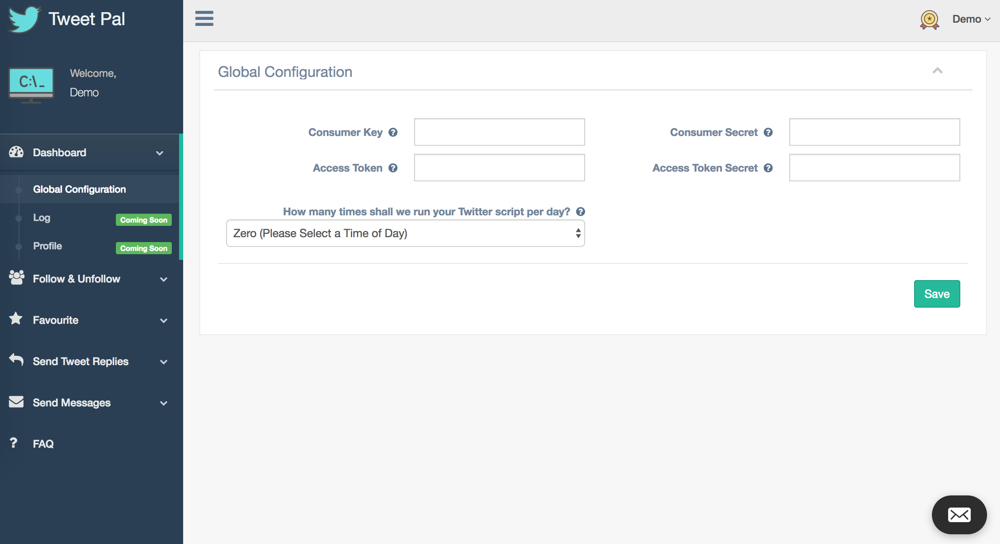

# Twitter-Auto-Pilot
TweetPal.io allows you to automate common Twitter activities such as following & unfollowing Twitter accounts, following users back, favoriting tweets that match a search query, sending messages to users who are following you. 

# Features
* Follow users of a certain user. 
* Follow users of a certain user, with a minimum amount of followers.
* Follow users of a certain user, with a minimum amount of tweets.
* Follow back users who are following you.
* Unfollow users who are not following you back.
* Favourite tweets that match a search query.
* Send messages to users who are following you.
* Send replies to tweeters of tweets that match a search query.

* Set the amoount of times to run your scripts each day.
* Set the Twitter accounts you like to use as the source of Twitter accounts to follow? i.e. you will follow people who follow the source accounts.
* Set the max delay in seconds between api requests.
* Set the max amount of users to unfollow in one run of this script.
* Set the max amount of users to follow in one run of this script.
* Set the max minimum number of followers a Twitter account must have in order to be followed. 
* Set the max minimum number of tweets a Twitter account must have in order to be followed. 
* Set the max amount of replies to Tweets in one run of this script.
* Set the max amount of messages to send to users you are following in one run of this script.
* Set the max amount of Tweets to favourite in one run of this script.
* Set the search query to be used when finding certain Tweets to be favourited.
* Set the search query to be used when finding certain Tweets to be replied to.
* The message to send to users who are following you.
* The message to send to Tweets that you are replying to.

# How to Use (Set & Forget)
1. Clone this repo & host it on your server.
2. Setup the database via the file frontend/production/utils/database_export.sql
3. Browse to frontend/production/index.php
4. Create an account.
5. Create a new twitter app at https://apps.twitter.com
6. Browse to your newly created app (on https://apps.twitter.com)
7. Copy in your four keys to your account dashboard.
8. Check the logs (frontend/production/logs) for detailed info on what your script is doing when executed.

If you have trouble copying the correct keys check out the following article: 
https://twittercommunity.com/t/how-do-i-find-my-consumer-key-and-secret/646/7

More questions are answered in the FAQ located at frontend/production/faq.php

OR

Go to tweetpal.io ;)
You can check out the demo account from there: 
Email: demo@gmail.com
Password: demo
PS: tweet me (@joeytawadrous) if you have questions or created a new account & want full access.

Search Queries
A query can have operators that modify its behaviour. Check out https://dev.twitter.com/rest/public/search for a full list of available queries.

# Future
In the near future I plan to add many more types of Twitter functions, making use of the following:
- favourites_count
- listed_count
- statuses_count
- favorite_count
- retweet_count

# Theme Credit
All credit for the beautiful admin theme used in TweetPal.io goes to https://github.com/puikinsh/gentelella

Feel free to Fork ;)
